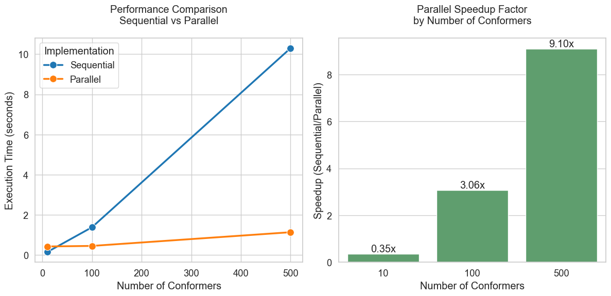

# Molecular Docking Optimization with HPC

This project demonstrates the power of **High-Performance Computing (HPC)** in molecular docking simulations by implementing parallelization techniques. Using [**RDKit**](https://www.rdkit.org/) as the core docking engine, the project provides a comprehensive benchmarking system to analyze performance improvements across different threading configurations.

## Table of Contents

- [Molecular Docking Optimization with HPC](#molecular-docking-optimization-with-hpc)
  - [Table of Contents](#table-of-contents)
  - [Overview](#overview)
  - [Features](#features)
  - [Installation](#installation)
    - [Prerequisites](#prerequisites)
    - [Clone the repository](#clone-the-repository)
    - [Environment Setup](#environment-setup)
      - [1. Create and activate conda environment](#1-create-and-activate-conda-environment)
      - [2. Install core numerical libraries](#2-install-core-numerical-libraries)
      - [3. Install RDKit and other dependencies](#3-install-rdkit-and-other-dependencies)

## Overview

Molecular docking is a computational technique used in drug discovery to predict binding orientations of small molecule drug candidates to their protein targets. These simulations are computationally intensive, particularly when evaluating a large number of conformers or testing many ligand-receptor pairs.

This project leverages parallel processing to significantly reduce computation times, demonstrating the advantages of HPC in optimizing molecular docking workflows. The implementation uses multithreading to distribute the conformer generation and scoring tasks across available CPU cores. By splitting the workload, the project achieves substantial speedups compared to sequential execution, as validated through detailed benchmarking across various system configurations.

**Key improvements include:**

- Utilization of thread pools for efficient task distribution.
- A scalable design capable of handling high-throughput docking studies.
- Benchmarks showing up to **10x** speedup for certain workloads, highlighting the impact of parallelization on computational efficiency.



## Features

- **Parallel Docking:**
  - Accelerated docking by leveraging multithreading with Python’s `concurrent.futures`.
  - Dynamic thread allocation ensures optimal CPU usage based on hardware capabilities.
- **Detailed Performance Benchmarking:**
  - Comprehensive metrics collection, including setup and execution timings.
  - Visual comparisons of sequential vs. parallel docking performance.
  - Speedup factor calculations to quantify improvements across workloads.
- **Scalability:**
  - Designed to handle large datasets, including thousands of ligand-receptor combinations.
  - Parallelization scales with the number of CPU cores, maximizing resource utilization.
- **Visualization and Analysis:**
  - Integrated plotting scripts using `matplotlib` and `seaborn` to visualize performance metrics.
  - Speedup charts and runtime comparisons for easy analysis.

## Installation

### Prerequisites

1. `Python 3.9`
2. `Git`
3. `Conda` (required)

### Clone the repository

```bash
git clone https://github.com/albipuliga/molecular-docking-hpc.git
cd molecular-docking-hpc
```

### Environment Setup

#### 1. Create and activate conda environment

```bash
conda create -n docking python=3.9 -y
conda activate docking
```

#### 2. Install core numerical libraries

```bash
conda install -c conda-forge numpy scipy lapack blas -y
```

#### 3. Install RDKit and other dependencies

```bash
conda install -c conda-forge rdkit matplotlib seaborn scikit-learn -y
```
